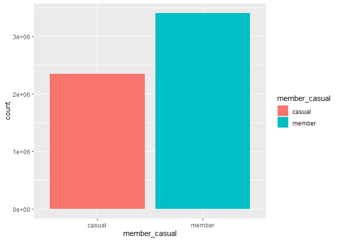
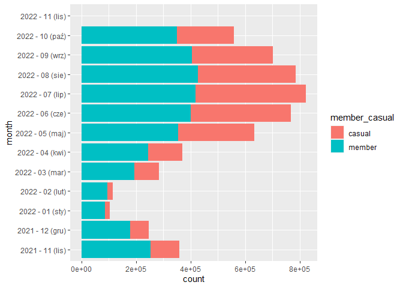
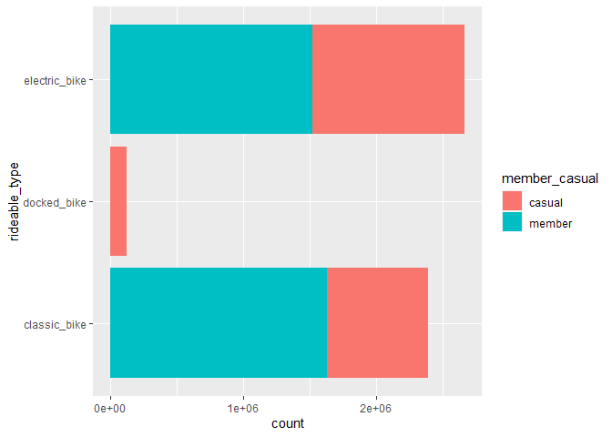
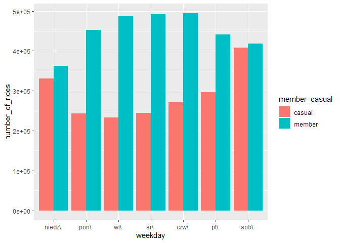
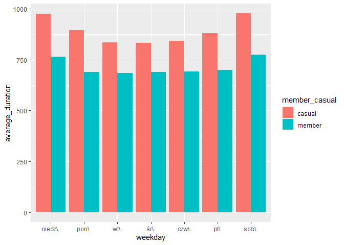
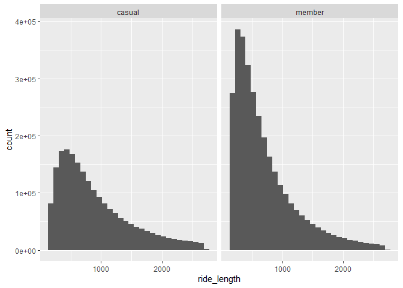
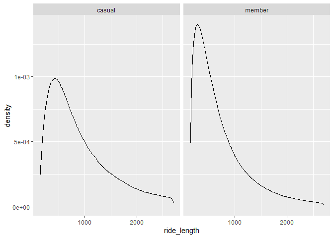
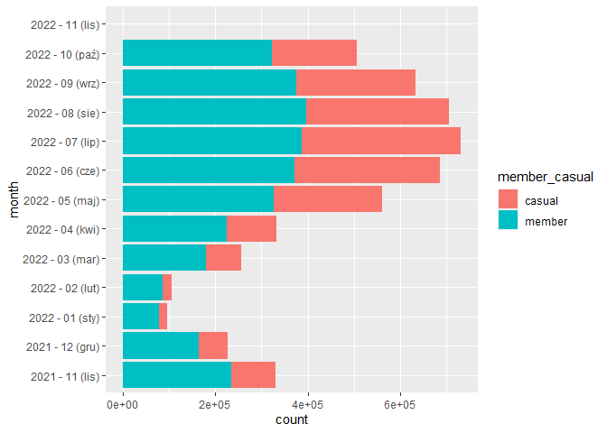

Google Capstone - Bike Case Study
================
Sebastian Suliborski
2022-11-23

# Case Study: How Does a Bike-Share Navigate Speedy Success?

This is the Cyclistic bike-share analysis case study from Google Data
Analytics Certificate. In this case study I imagine that I work for a
fictional company, Cyclistic.

## Scenario

In the beginning is good to present the scenario of case study. It is as
follows:  
“You are a junior data analyst working in the marketing analyst team at
Cyclistic, a bike-share company in Chicago. The director of marketing
believs the company’s future success depends on maximizing the nubmer of
annual membership.Therefore, your team wants to understand how casual
riders and annual members use Cyclistic bikes differently. From these
insights, your team will design a new marketing strategy to convert
casual riders into annual members. But first, Cyclistic executives must
approve your recommendations, so they must be backed up with compelling
data insights and professional data visualizations.  

I will follow the scenario based on six phases of analysis:  
1) Ask  
2) Prepare  
3) Proccess  
4) Analyze  
5) Share  
6) Act

## Ask

There is three guiding questions:  
1. How do annual members and casual riders use Cyclistic bikes
differently?  
2. Why would casual riders buy Cyclistic annual memberships?  
3. How can Cyclistic use digital media to influence casual riders to
become members?  

And for me the most important is first, how do annual and casual riders
use bikes differently?  

In this report I should include those deliverables:  
1. A clear statement of the business task  
2. A description of all data sources used  
3. Documentation of any cleaning or manipulation of data  
4. A summary of your analysis  
5. Supporting vizzes and key findings  
6. Your top three recommendations based on your analysis.

## Prepare

In this case study I used RStudio 2022.07.2 Build 576, R version 4.2.0.
Full case study was made in R and Tableau, but for this R markdown file
I made second version only in RStudio.

Libraries:

``` r
library(tidyverse)
```

    ## ── Attaching packages ─────────────────────────────────────── tidyverse 1.3.1 ──

    ## ✔ ggplot2 3.3.6     ✔ purrr   0.3.4
    ## ✔ tibble  3.1.6     ✔ dplyr   1.0.9
    ## ✔ tidyr   1.2.0     ✔ stringr 1.4.0
    ## ✔ readr   2.1.2     ✔ forcats 0.5.1

    ## ── Conflicts ────────────────────────────────────────── tidyverse_conflicts() ──
    ## ✖ dplyr::filter() masks stats::filter()
    ## ✖ dplyr::lag()    masks stats::lag()

``` r
library(lubridate)
```

    ## 
    ## Dołączanie pakietu: 'lubridate'

    ## Następujące obiekty zostały zakryte z 'package:base':
    ## 
    ##     date, intersect, setdiff, union

``` r
library(readr)
library(janitor)
```

    ## Warning: pakiet 'janitor' został zbudowany w wersji R 4.2.2

    ## 
    ## Dołączanie pakietu: 'janitor'

    ## Następujące obiekty zostały zakryte z 'package:stats':
    ## 
    ##     chisq.test, fisher.test

``` r
library(ggplot2)
```

Data loading:

``` r
d0 <- read.csv(file = "C:/Users/sebas/OneDrive/Pulpit/google data/gda_case_study/csvs/202111-divvy-tripdata.csv", 
               header = TRUE, sep = ',') 
d1 <- read.csv(file = "C:/Users/sebas/OneDrive/Pulpit/google data/gda_case_study/csvs/202112-divvy-tripdata.csv", 
               header = TRUE, sep = ',')
d2 <- read.csv(file = "C:/Users/sebas/OneDrive/Pulpit/google data/gda_case_study/csvs/202201-divvy-tripdata.csv", 
               header = TRUE, sep = ',')
d3 <- read.csv(file = "C:/Users/sebas/OneDrive/Pulpit/google data/gda_case_study/csvs/202202-divvy-tripdata.csv", 
               header = TRUE, sep = ',')
d4 <- read.csv(file = "C:/Users/sebas/OneDrive/Pulpit/google data/gda_case_study/csvs/202203-divvy-tripdata.csv", 
               header = TRUE, sep = ',')
d5 <- read.csv(file = "C:/Users/sebas/OneDrive/Pulpit/google data/gda_case_study/csvs/202204-divvy-tripdata.csv", 
               header = TRUE, sep = ',')
d6 <- read.csv(file = "C:/Users/sebas/OneDrive/Pulpit/google data/gda_case_study/csvs/202205-divvy-tripdata.csv", 
               header = TRUE, sep = ',')
d7 <- read.csv(file = "C:/Users/sebas/OneDrive/Pulpit/google data/gda_case_study/csvs/202206-divvy-tripdata.csv", 
               header = TRUE, sep = ',')
d8 <- read.csv(file = "C:/Users/sebas/OneDrive/Pulpit/google data/gda_case_study/csvs/202207-divvy-tripdata.csv", 
               header = TRUE, sep = ',')
d9 <- read.csv(file = "C:/Users/sebas/OneDrive/Pulpit/google data/gda_case_study/csvs/202208-divvy-tripdata.csv", 
               header = TRUE, sep = ',')
d10 <- read.csv(file = "C:/Users/sebas/OneDrive/Pulpit/google data/gda_case_study/csvs/202209-divvy-publictripdata.csv", 
                header = TRUE, sep = ',')
d11 <- read.csv(file = "C:/Users/sebas/OneDrive/Pulpit/google data/gda_case_study/csvs/202210-divvy-tripdata.csv", 
                header = TRUE, sep = ',')
```

I have data from last 12 months, between november 2021 to october 2022,
provided by the fiction Cyclistic company. Data merging:

``` r
raw_data <- rbind(d0, d1, d2, d3, d4, d5, d6, d7, d8, d9, d10, d11)
```

View merged data:

``` r
summary(raw_data)
```

    ##    ride_id          rideable_type       started_at          ended_at        
    ##  Length:5755694     Length:5755694     Length:5755694     Length:5755694    
    ##  Class :character   Class :character   Class :character   Class :character  
    ##  Mode  :character   Mode  :character   Mode  :character   Mode  :character  
    ##                                                                             
    ##                                                                             
    ##                                                                             
    ##                                                                             
    ##  start_station_name start_station_id   end_station_name   end_station_id    
    ##  Length:5755694     Length:5755694     Length:5755694     Length:5755694    
    ##  Class :character   Class :character   Class :character   Class :character  
    ##  Mode  :character   Mode  :character   Mode  :character   Mode  :character  
    ##                                                                             
    ##                                                                             
    ##                                                                             
    ##                                                                             
    ##    start_lat       start_lng         end_lat         end_lng      
    ##  Min.   :41.64   Min.   :-87.84   Min.   :41.39   Min.   :-88.97  
    ##  1st Qu.:41.88   1st Qu.:-87.66   1st Qu.:41.88   1st Qu.:-87.66  
    ##  Median :41.90   Median :-87.64   Median :41.90   Median :-87.64  
    ##  Mean   :41.90   Mean   :-87.65   Mean   :41.90   Mean   :-87.65  
    ##  3rd Qu.:41.93   3rd Qu.:-87.63   3rd Qu.:41.93   3rd Qu.:-87.63  
    ##  Max.   :45.64   Max.   :-73.80   Max.   :42.37   Max.   :-87.30  
    ##                                   NA's   :5835    NA's   :5835    
    ##  member_casual     
    ##  Length:5755694    
    ##  Class :character  
    ##  Mode  :character  
    ##                    
    ##                    
    ##                    
    ## 

``` r
str(raw_data)
```

    ## 'data.frame':    5755694 obs. of  13 variables:
    ##  $ ride_id           : chr  "7C00A93E10556E47" "90854840DFD508BA" "0A7D10CDD144061C" "2F3BE33085BCFF02" ...
    ##  $ rideable_type     : chr  "electric_bike" "electric_bike" "electric_bike" "electric_bike" ...
    ##  $ started_at        : chr  "2021-11-27 13:27:38" "2021-11-27 13:38:25" "2021-11-26 22:03:34" "2021-11-27 09:56:49" ...
    ##  $ ended_at          : chr  "2021-11-27 13:46:38" "2021-11-27 13:56:10" "2021-11-26 22:05:56" "2021-11-27 10:01:50" ...
    ##  $ start_station_name: chr  "" "" "" "" ...
    ##  $ start_station_id  : chr  "" "" "" "" ...
    ##  $ end_station_name  : chr  "" "" "" "" ...
    ##  $ end_station_id    : chr  "" "" "" "" ...
    ##  $ start_lat         : num  41.9 42 42 41.9 41.9 ...
    ##  $ start_lng         : num  -87.7 -87.7 -87.7 -87.8 -87.6 ...
    ##  $ end_lat           : num  42 41.9 42 41.9 41.9 ...
    ##  $ end_lng           : num  -87.7 -87.7 -87.7 -87.8 -87.6 ...
    ##  $ member_casual     : chr  "casual" "casual" "casual" "casual" ...

``` r
unique(raw_data$rideable_type)
```

    ## [1] "electric_bike" "classic_bike"  "docked_bike"

Now it is very large dataset with more than 4 milion rows and 13 columns
that contain:  
- ride_id - id for each trip taken; char  
- rideable_type - type of a bike, there is two types: electric_bike,
classic_bike and docked_bike; char  
- started_at - date and time of the start time; for now char, I will
make it POSIXct  
- ended_at - date and time of the end time; for now char, I will make it
POSIXct  
- start_station_name - name of the starting station; char  
- start_station_id - id of the starting station; char  
- end_station_name - name of the ending station;char  
- end_station_id - id of the ending station; char  
- start_lat - latitude of the starting point  
- start_lng - longitude of the starting point  
- end_lat - latitude of the ending point  
- end_lng - longitude of the ending point  
- member_casual - client status - member or casual; char  

I will create four new columns:  
- ride_length - time of the trip in seconds  
- weekday - weekday of the trip, 7 levels from Monday to Sunday  
- month - month of the trip; int, 1-12  
- day - day of the trip; int, 1-31

## Proccess

Removing empty cols and rows:

``` r
raw_data <- remove_empty(raw_data, which = c("cols"))
raw_data <- remove_empty(raw_data, which = c("rows"))
dim(raw_data)
```

    ## [1] 5755694      13

Cleaning names:

``` r
clean_data <- clean_names(raw_data)
```

NA values:

``` r
colSums(is.na(clean_data))
```

    ##            ride_id      rideable_type         started_at           ended_at 
    ##                  0                  0                  0                  0 
    ## start_station_name   start_station_id   end_station_name     end_station_id 
    ##                  0                  0                  0                  0 
    ##          start_lat          start_lng            end_lat            end_lng 
    ##                  0                  0               5835               5835 
    ##      member_casual 
    ##                  0

``` r
clean_data <- clean_data[complete.cases(clean_data), ]

colSums(is.na(clean_data))
```

    ##            ride_id      rideable_type         started_at           ended_at 
    ##                  0                  0                  0                  0 
    ## start_station_name   start_station_id   end_station_name     end_station_id 
    ##                  0                  0                  0                  0 
    ##          start_lat          start_lng            end_lat            end_lng 
    ##                  0                  0                  0                  0 
    ##      member_casual 
    ##                  0

I will not need cols with long and lat. I will analyze without geografic
point of view.

Remove cols with long and lat:

``` r
remove_data <- clean_data %>%
  select(-c(start_lat, start_lng, end_lat, end_lng))
View(remove_data)
```

I need date&time data time, so I need to convert time type:

``` r
remove_data$started_at <- as.POSIXct(remove_data$started_at, "%Y-%m-%d %H:%M:%S", tz="Europe/London")
remove_data$ended_at <- as.POSIXct(remove_data$ended_at, "%Y-%m-%d %H:%M:%S", tz="Europe/London")

str(remove_data)
```

    ## 'data.frame':    5749859 obs. of  9 variables:
    ##  $ ride_id           : chr  "7C00A93E10556E47" "90854840DFD508BA" "0A7D10CDD144061C" "2F3BE33085BCFF02" ...
    ##  $ rideable_type     : chr  "electric_bike" "electric_bike" "electric_bike" "electric_bike" ...
    ##  $ started_at        : POSIXct, format: "2021-11-27 13:27:38" "2021-11-27 13:38:25" ...
    ##  $ ended_at          : POSIXct, format: "2021-11-27 13:46:38" "2021-11-27 13:56:10" ...
    ##  $ start_station_name: chr  "" "" "" "" ...
    ##  $ start_station_id  : chr  "" "" "" "" ...
    ##  $ end_station_name  : chr  "" "" "" "" ...
    ##  $ end_station_id    : chr  "" "" "" "" ...
    ##  $ member_casual     : chr  "casual" "casual" "casual" "casual" ...

Remove started_at greater than ended_at:

``` r
fremove_data <- remove_data %>%
  filter(remove_data$started_at < remove_data$ended_at)
```

Add column ride_length for better understand and visual time of trips:

``` r
add_data <- fremove_data %>%
  mutate(ride_length = as.numeric(fremove_data$ended_at - fremove_data$started_at))
summary(add_data$ride_length)
```

    ##    Min. 1st Qu.  Median    Mean 3rd Qu.    Max. 
    ##       1     351     620     988    1112 2057644

Add weekday:

``` r
add_data <- add_data %>%
  mutate(weekday = paste(strftime(add_data$ended_at, "%u")))
unique(add_data$weekday)
```

    ## [1] "6" "5" "2" "1" "4" "7" "3"

Aggregation data for each day and month (I made aggregation for weekday,
but I also could need for month and days):

``` r
add_data <- add_data %>%
    mutate(month = paste(strftime(add_data$started_at, "%Y"),
                              "-",
                              strftime(add_data$started_at, "%m"),
                              paste("(",strftime(add_data$started_at, "%b"), ")", sep="")))
unique(add_data$month)
```

    ##  [1] "2021 - 11 (lis)" "2021 - 12 (gru)" "2022 - 01 (sty)" "2022 - 02 (lut)"
    ##  [5] "2022 - 03 (mar)" "2022 - 04 (kwi)" "2022 - 05 (maj)" "2022 - 06 (cze)"
    ##  [9] "2022 - 07 (lip)" "2022 - 08 (sie)" "2022 - 09 (wrz)" "2022 - 10 (paź)"
    ## [13] "2022 - 11 (lis)"

``` r
add_data <- add_data %>%
  mutate(day = paste(strftime(add_data$ended_at, "%d")))
add_data$day <- as.integer(add_data$day)
unique(add_data$day)
```

    ##  [1] 27 26  2  1 25  6  5 14 13  4  3  9  8 15 29 28 18 17 10 19  7 12 11 20 24
    ## [26] 23 21 22 30 16 31

Data summary after cleaning:

``` r
str(add_data)
```

    ## 'data.frame':    5749174 obs. of  13 variables:
    ##  $ ride_id           : chr  "7C00A93E10556E47" "90854840DFD508BA" "0A7D10CDD144061C" "2F3BE33085BCFF02" ...
    ##  $ rideable_type     : chr  "electric_bike" "electric_bike" "electric_bike" "electric_bike" ...
    ##  $ started_at        : POSIXct, format: "2021-11-27 13:27:38" "2021-11-27 13:38:25" ...
    ##  $ ended_at          : POSIXct, format: "2021-11-27 13:46:38" "2021-11-27 13:56:10" ...
    ##  $ start_station_name: chr  "" "" "" "" ...
    ##  $ start_station_id  : chr  "" "" "" "" ...
    ##  $ end_station_name  : chr  "" "" "" "" ...
    ##  $ end_station_id    : chr  "" "" "" "" ...
    ##  $ member_casual     : chr  "casual" "casual" "casual" "casual" ...
    ##  $ ride_length       : num  1140 1065 142 301 1273 ...
    ##  $ weekday           : chr  "6" "6" "5" "6" ...
    ##  $ month             : chr  "2021 - 11 (lis)" "2021 - 11 (lis)" "2021 - 11 (lis)" "2021 - 11 (lis)" ...
    ##  $ day               : int  27 27 26 27 26 26 27 27 27 27 ...

``` r
summary(add_data)
```

    ##    ride_id          rideable_type        started_at                    
    ##  Length:5749174     Length:5749174     Min.   :2021-11-01 00:00:14.00  
    ##  Class :character   Class :character   1st Qu.:2022-04-27 16:23:52.25  
    ##  Mode  :character   Mode  :character   Median :2022-06-30 18:30:36.50  
    ##                                        Mean   :2022-06-13 23:03:56.46  
    ##                                        3rd Qu.:2022-08-24 19:56:26.00  
    ##                                        Max.   :2022-10-31 23:59:33.00  
    ##     ended_at                      start_station_name start_station_id  
    ##  Min.   :2021-11-01 00:04:06.00   Length:5749174     Length:5749174    
    ##  1st Qu.:2022-04-27 16:32:56.25   Class :character   Class :character  
    ##  Median :2022-06-30 18:47:23.00   Mode  :character   Mode  :character  
    ##  Mean   :2022-06-13 23:20:24.50                                        
    ##  3rd Qu.:2022-08-24 20:11:14.00                                        
    ##  Max.   :2022-11-01 08:59:46.00                                        
    ##  end_station_name   end_station_id     member_casual       ride_length     
    ##  Length:5749174     Length:5749174     Length:5749174     Min.   :      1  
    ##  Class :character   Class :character   Class :character   1st Qu.:    351  
    ##  Mode  :character   Mode  :character   Mode  :character   Median :    620  
    ##                                                           Mean   :    988  
    ##                                                           3rd Qu.:   1112  
    ##                                                           Max.   :2057644  
    ##    weekday             month                day       
    ##  Length:5749174     Length:5749174     Min.   : 1.00  
    ##  Class :character   Class :character   1st Qu.: 8.00  
    ##  Mode  :character   Mode  :character   Median :16.00  
    ##                                        Mean   :15.79  
    ##                                        3rd Qu.:23.00  
    ##                                        Max.   :31.00

## Analyze

Guiding questions:  
- ogranizing and formatting  
- what I discovered  
- trends and relationships  

So I need to:  
- aggregate data  
- organize and format them  
- perform calculations  
- identify trends and relationships

``` r
ggplot(add_data, aes(member_casual, fill = member_casual)) +
    geom_bar()
```

<!-- -->
There is much more data for members. Checking the quantities for months
also can have value:

``` r
add_data %>%
  ggplot(aes(month, fill = member_casual)) +
  geom_bar() +
  coord_flip()
```

<!-- -->

Descriptive analysis on ride_length (in seconds):

``` r
mean(add_data$ride_length) #straight average (total ride length / rides)
```

    ## [1] 988.0493

``` r
median(add_data$ride_length) #midpoint number in the ascending array of ride lengths
```

    ## [1] 620

``` r
max(add_data$ride_length) #longest ride
```

    ## [1] 2057644

``` r
min(add_data$ride_length) #shortest ride
```

    ## [1] 1

Ride_length mean is \~998 seconds.Max - 2057644, min 1 second - and
there is many 1 sec trips, so it’s neccessary to remove too short rides.
It could be when member rented bike but there was problem with bike or
app, or it was some other error. 2057644 is equal to almost 24 days -
bike was lost or robbed. Outlier results should be removed for better
understanding and visualizating of data.

``` r
ventiles = quantile(add_data$ride_length, seq(0, 1, by=0.05))
add_data <- add_data %>% 
    filter(ride_length > as.numeric(ventiles['5%'])) %>%
    filter(ride_length < as.numeric(ventiles['95%']))
summary(add_data$ride_length)
```

    ##    Min. 1st Qu.  Median    Mean 3rd Qu.    Max. 
    ##   143.0   374.0   620.0   784.8  1039.0  2702.0

Compare casuals to members:

``` r
aggregate(add_data$ride_length ~ add_data$member_casual, FUN = mean)
```

    ##   add_data$member_casual add_data$ride_length
    ## 1                 casual             900.8143
    ## 2                 member             710.0979

``` r
aggregate(add_data$ride_length ~ add_data$member_casual, FUN = median)
```

    ##   add_data$member_casual add_data$ride_length
    ## 1                 casual                  738
    ## 2                 member                  553

``` r
aggregate(add_data$ride_length ~ add_data$member_casual, FUN = max)
```

    ##   add_data$member_casual add_data$ride_length
    ## 1                 casual                 2702
    ## 2                 member                 2702

``` r
aggregate(add_data$ride_length ~ add_data$member_casual, FUN = min)
```

    ##   add_data$member_casual add_data$ride_length
    ## 1                 casual                  143
    ## 2                 member                  143

Casuals rides longer than members.

Average ride time by each day for members vs casual users:

``` r
aggregate(add_data$ride_length ~ add_data$member_casual + add_data$weekday, FUN = mean)
```

    ##    add_data$member_casual add_data$weekday add_data$ride_length
    ## 1                  casual                1             896.4307
    ## 2                  member                1             690.2459
    ## 3                  casual                2             836.4589
    ## 4                  member                2             683.6124
    ## 5                  casual                3             832.6066
    ## 6                  member                3             688.1959
    ## 7                  casual                4             841.7268
    ## 8                  member                4             692.1215
    ## 9                  casual                5             877.4185
    ## 10                 member                5             698.8890
    ## 11                 casual                6             974.8001
    ## 12                 member                6             772.2667
    ## 13                 casual                7             974.8970
    ## 14                 member                7             765.2102

Both - casuals and members riding the most at the fridays and saturdays.
Differences between individual days are smaller in member group. So we
can conclude that members often go to work on bikes, casuals probalby
often just rides “casual” like on trips and just for the ride at the day
off.

Fix order of dayweek:

``` r
add_data$weekday <- ordered(add_data$weekday, levels=c("Sunday", "Monday", "Tuesday", "Wednesday", "Thursday", "Friday", "Saturday"))
```

What about rideable type? On which type of bike rides more members and
casuals?

``` r
ggplot(add_data, aes(rideable_type, fill=member_casual)) +
    geom_bar() +
    coord_flip()
```

<!-- -->
Casuals like more electric bikes than classic bikes. It can be assumed
that they value convenience more than price (of course, if electric
bikes cost more, which is probably). Also we can see that only casuals
ride on docked bike.

Analyze data by type and weekday:

``` r
add_data %>% 
  mutate(weekday = wday(started_at, label = TRUE)) %>%  
  group_by(member_casual, weekday) %>%  
  summarise(number_of_rides = n()                        
            ,average_duration = mean(ride_length)) %>%  
  arrange(member_casual, weekday)                           
```

    ## `summarise()` has grouped output by 'member_casual'. You can override using the
    ## `.groups` argument.

    ## # A tibble: 14 × 4
    ## # Groups:   member_casual [2]
    ##    member_casual weekday    number_of_rides average_duration
    ##    <chr>         <ord>                <int>            <dbl>
    ##  1 casual        "niedz\\."          330951             975.
    ##  2 casual        "pon\\."            243055             894.
    ##  3 casual        "wt\\."             232455             835.
    ##  4 casual        "śr\\."             244311             833.
    ##  5 casual        "czw\\."            271013             842.
    ##  6 casual        "pt\\."             296696             880.
    ##  7 casual        "sob\\."            407866             977.
    ##  8 member        "niedz\\."          362701             763.
    ##  9 member        "pon\\."            452767             690.
    ## 10 member        "wt\\."             486162             684.
    ## 11 member        "śr\\."             491943             689.
    ## 12 member        "czw\\."            493970             692.
    ## 13 member        "pt\\."             441149             700.
    ## 14 member        "sob\\."            418210             773.

Again - casual rides longer than members and the biggest number of rides
for casuals is at the weekend and members in tuesday and thursday. The
longest rides for casuals are in saturday and sundays, for members it’s
similar at all days.

Viz number of rides by rider type:

``` r
add_data %>% 
  mutate(weekday = wday(started_at, label = TRUE)) %>% 
  group_by(member_casual, weekday) %>% 
  summarise(number_of_rides = n()
            ,average_duration = mean(ride_length)) %>% 
  arrange(member_casual, weekday)  %>% 
  ggplot(aes(x = weekday, y = number_of_rides, fill = member_casual)) +
  geom_col(position = "dodge")
```

    ## `summarise()` has grouped output by 'member_casual'. You can override using the
    ## `.groups` argument.

<!-- -->

Viz for rides length by weekday and type of members:

``` r
add_data %>% 
  mutate(weekday = wday(started_at, label = TRUE)) %>% 
  group_by(member_casual, weekday) %>% 
  summarise(number_of_rides = n()
            ,average_duration = mean(ride_length)) %>% 
  arrange(member_casual, weekday)  %>% 
  ggplot(aes(x = weekday, y = average_duration, fill = member_casual)) +
  geom_col(position = "dodge")
```

    ## `summarise()` has grouped output by 'member_casual'. You can override using the
    ## `.groups` argument.

<!-- -->

Duration vs distance:

``` r
ggplot(filter(add_data, add_data$ride_length < 3600)) +
  geom_histogram(mapping = aes(x = ride_length)) +
  facet_wrap(~member_casual)
```

    ## `stat_bin()` using `bins = 30`. Pick better value with `binwidth`.

<!-- -->

These two vizzes confirms previous conclusions.

Distance travelled in meters:

``` r
ggplot(filter(add_data, add_data$ride_length < 10000)) +
  geom_density(mapping = aes(x = ride_length)) +
  facet_wrap(~member_casual)
```

<!-- -->

``` r
add_data %>%
  ggplot(aes(month, fill=member_casual)) +
    geom_bar()  +
  coord_flip()
```

<!-- -->

## Share

After analysis, many lines of code and vizzes it’s time for share
results answering on question: “How can we convert casuals to
members?”.  
There were many data - almost 6 milion observations, but there weren’t
enough information to fully answer this question. It could be better
with gender, age and some other more accurate data like behavior of
users when they were casuals and then members, however I can answer more
or less based on the data I had.  
So, here some conlucions based on this dataset:  
- Members using bikes similar throughout whole week except Saturday
(small difference) and Sunday (bigger difference). Probably it’s because
they are mostly working people, but it isn’t possible to say 100%
because there is no data on whether the user is working or not, but
pattern says enough.  
- Casuals using bikes more at the weekends, especially Saturday.Can be
assumed that is for recreation or for sport. These trips are longer than
members trips in middle week.  
- Classic bikes are most popular for members and electric for casuals.
Docked bikes are used only by casuals.  
- Many electric bikes has missing start or end station. This is not an
case for marketing team, but for IT, there maybe some issues with
registrating bikes.  
- Casuals using bike longer than members, but members more.  
- Most rides are in warm months like june, july, august - also months of
the vacation. In the most cold months like january and february there
only few casuals and even not many members (but for them difference is
less), so marketing actions aren’t needed in these months.  

## Act

For our goal, “How can we convert casuals to members?” we can suggest:  
- Increase renting price for the weekend for casuals or decrease renting
price for members. It could make that some casuals take subscription for
cheaper weekend trips. These trips also could be cheaper in a long
yourneys.  
- We can create new, weekend subscription for the same goal as in first
idea. Casuals who going to trips at the weekend could take it. They can
drive car to work or work from home, so they don’t need a classic
subscription, but this new subscription should encourage them.  
- We can provide a special service or promotions/loyalty cards and
personal ads for members to motivate casuals to have a subscription.
Marketing campaigns should work best in the spring and summer seasons,
when the number of rides increases and peaks in the summer. Also we can
have banners and leaflets close to most popular stations.  
- Electric bikes - issue for IT team. Why is it missing and how to
repair it.  

There is four main recommendations for this dataset, but if it were more
data like for age, gender and job of users then analysis could be more
complex and bring some ideas for future analysis.
